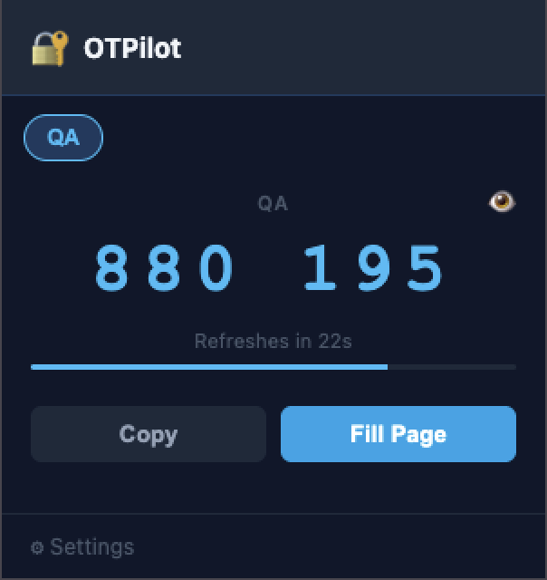
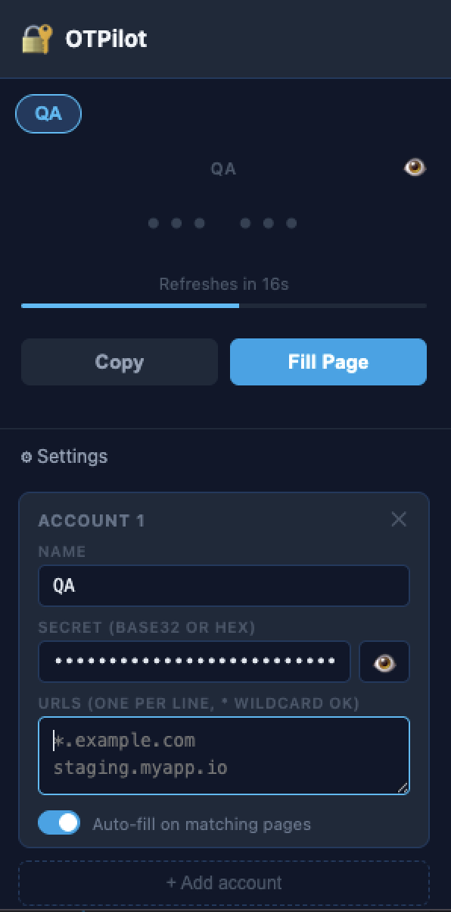
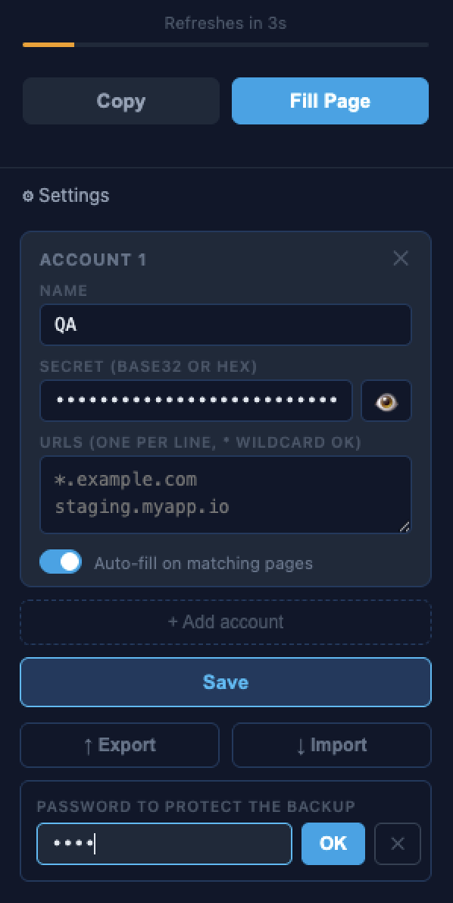

# OTPilot

A minimal Chrome extension that auto-fills TOTP (2FA) codes on any login page you configure. Works like Google Authenticator but lives in your browser and fills the field for you.

> **Version:** 0.0.1 · Manifest V3 · No dependencies · No bundler

---

<p align="center">
  
</p>

---

## Features

- **Master password lock** — the extension is gated behind a master password; sessions last 24 h or 30 days
- **Auto-fill & submit** — detects OTP input fields and fills them automatically when you land on a matching page
- **Multiple accounts** — add as many accounts as you need, each with its own name, secret and URL list
- **URL-based matching** — each account maps to one or more URLs (wildcard `*` supported); the right secret is picked automatically
- **Any secret format** — accepts both **base32** (Google Authenticator style) and **hex** secrets
- **Encrypted backup** — export all accounts to a password-protected JSON file; import it on any machine
- **No bundler, no build step** — plain vanilla JS, load unpacked and done

---

## Installation

OTPilot is not on the Chrome Web Store. Load it manually:

1. Download or clone this repository
2. Open Chrome and go to `chrome://extensions`
3. Enable **Developer mode** (toggle in the top-right corner)
4. Click **Load unpacked** and select the `otpilot` folder
5. The OTPilot icon will appear in your toolbar

---

## First use

On the first open, OTPilot asks you to create a **master password**. This password protects access to the extension. You will be asked for it again once your session expires.

- Choose **Keep me logged in for 30 days** to extend the session; otherwise it lasts 24 hours.
- Click the 🔒 button in the header at any time to lock the extension manually.

---

## Setup

### Adding an account

<p align="center">
  
</p>

1. Click the OTPilot icon in the toolbar
2. Expand **Settings**
3. Click **+ Add account**
4. Fill in:
   - **Name** — label shown on the tab (e.g. `Work QA`)
   - **Secret** — your TOTP secret in base32 or hex
   - **URLs** — one hostname per line, `*` wildcard supported:
     ```
     *.staging.example.com
     admin.myapp.io
     ```
5. Click **Save**

The account tab appears at the top of the popup and the code starts ticking immediately.

### Auto-fill

When you navigate to a page whose hostname matches one of the configured URLs and an OTP field is detected, OTPilot fills and submits the form automatically. A green toast confirms the action.

If the extension is locked when you land on an OTP page, a toast prompts you to unlock. Once you log in, the fill is triggered automatically.

You can also trigger a fill manually by clicking **Fill Page** in the popup.

---

## Backup & Restore

<p align="center">
  
</p>

### Export
1. Open Settings → click **↑ Export**
2. Enter a password
3. `otpilot-backup.json` is downloaded

### Import
1. Open Settings → click **↓ Import**
2. Select your `otpilot-backup.json`
3. Enter the password used when exporting

The backup file is encrypted with **AES-GCM 256-bit**. The key is derived from your password using **PBKDF2** (SHA-256, 200 000 iterations). Without the password the file is unreadable.

---

## Security notes

- Access to the extension is protected by a master password; the session expires after 24 h (or 30 days if opted in)
- Secrets are stored in `chrome.storage.local` — sandboxed to this extension, not accessible by web pages or other extensions
- The content script runs on every page but exits immediately if no configured URL matches or no OTP field is found
- No data is ever sent to any server
- The extension requests `*://*/*` host permission so the content script can run on user-defined URLs; it never reads page content beyond looking for an OTP input field

---

## Project structure

```
otpilot/
├── manifest.json      # MV3 manifest
├── totp.js            # TOTP algorithm (RFC 6238) via Web Crypto API
├── content.js         # Auto-fill logic injected into matching pages
├── popup.html         # Extension popup UI
├── popup.js           # Popup logic, account management, export/import, lock/session
├── icon.svg           # Source icon
├── icon16.png
├── icon48.png
└── icon128.png
```

---

## License

GNU General Public License v3.0 — see [LICENSE](LICENSE) for details.

---

## Developer notes

### Building the ZIP for store submission

The ZIP must contain only the extension files — no `docs/`, `releases/`, `.DS_Store`, or other metadata.

```bash
cd /path/to/otpilot

zip -r releases/otpilot-$(grep '"version"' manifest.json | awk -F'"' '{print $4}').zip \
  manifest.json \
  popup.html popup.js \
  content.js totp.js \
  icon16.png icon48.png icon128.png
```

Verify the contents before uploading:

```bash
unzip -l releases/otpilot-*.zip
```

### Deploying the privacy policy to Vercel

The privacy policy lives in `docs/privacy.html` and is deployed as a static site via Vercel.

**First deploy (one-time setup):**

```bash
npm i -g vercel
cd docs
vercel
```

Follow the prompts: link to your Vercel account, set the project name, confirm the root directory is `docs/`. Vercel will give you a production URL — use that URL in the store listing's "Privacy policy URL" field.

**Subsequent deploys:**

```bash
cd docs
vercel --prod
```

No build step is needed; Vercel serves `privacy.html` as a static file directly.
